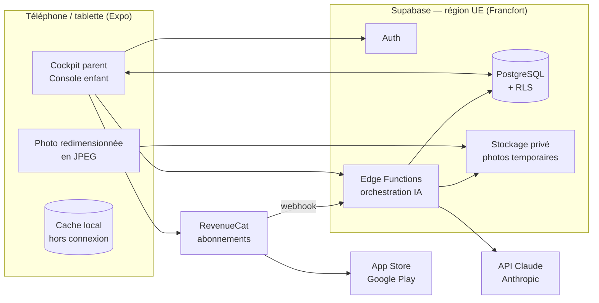
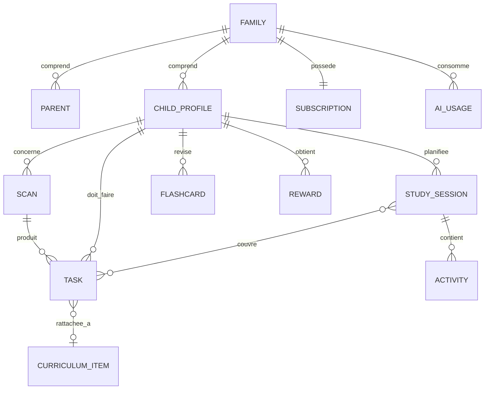
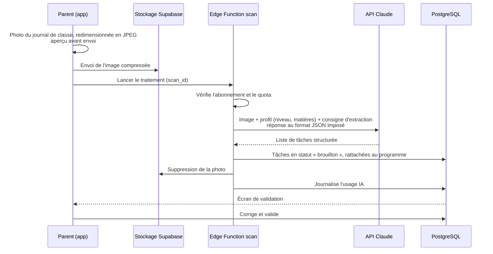

# Côte à Côte — Architecture technique

> Version 0.1 — octobre 2026 — document de travail
> Complète le [cahier des charges](./cahier-des-charges.md).

---

## 1. Principes

1. **Un seul développeur** : privilégier les services gérés et une seule base de code. Pas de serveur à administrer.
2. **Vie privée par conception** : prénom seulement, aucun nom recopié par l'IA, hébergement UE, suppression des photos après traitement.
3. **L'IA ne parle jamais directement à l'application** : tous les appels passent par le serveur, qui protège la clé API, applique les quotas et journalise les coûts.
4. **Le parent valide** : chaque sortie de l'IA passe par un état « brouillon » avant d'être publiée.

## 2. Vue d'ensemble



## 3. Choix techniques

| Besoin | Choix | Raison |
|---|---|---|
| Application mobile et tablette | **Expo (React Native) + TypeScript** | Une base de code iOS/Android, builds dans le cloud (EAS), mises à jour sans passer par les stores pour le JavaScript |
| Navigation | **Expo Router** | Navigation par fichiers, séparation simple parent / enfant |
| Interface | Composants maison + thème accessible | Thèmes par profil (police, tailles, espacements), sans dépendance lourde |
| État serveur | **TanStack Query** | Cache, synchronisation, mode hors connexion |
| Base de données, authentification, stockage | **Supabase** (région UE) | PostgreSQL géré, sécurité par lignes (RLS), stockage, fonctions serveur |
| Logique serveur et IA | **Supabase Edge Functions** (Deno, TypeScript) + SDK officiel `@anthropic-ai/sdk` | Même langage que l'application, pas de serveur à gérer |
| IA | **API Claude** | Lecture de l'écriture manuscrite, qualité du français, sorties structurées |
| Préparation des photos | **expo-image-manipulator** | Redimensionnement (1600 px au plus) et conversion en JPEG avant l'envoi : envoi léger, coût IA maîtrisé |
| Abonnements | **RevenueCat** | Gère App Store et Google Play, webhooks vers Supabase |
| Génération PDF | **expo-print** (HTML vers PDF) | Mise en page accessible en HTML/CSS, impression native |
| Notifications | **Expo Notifications** | Rappels d'échéances, alertes de charge |
| Suivi des erreurs | **Sentry** | Plan gratuit suffisant au départ |
| Tests | **Jest** + **React Native Testing Library**, **Maestro** pour les parcours de bout en bout | |
| Intégration continue | **GitHub Actions** + **EAS Build** | Lint, types, tests à chaque push ; builds de test |

## 4. Organisation du dépôt

```
C-te-C-te/
├── apps/
│   └── mobile/                 # Application Expo
│       ├── app/                # Écrans (Expo Router)
│       │   ├── (auth)/         # Connexion, inscription
│       │   ├── (parent)/       # Cockpit parent
│       │   └── (enfant)/       # Console enfant
│       ├── components/
│       ├── features/           # scan, planning, pomodoro, profils…
│       ├── lib/                # client Supabase, thèmes accessibles
│       └── modules/            # module natif de détection de texte
├── supabase/
│   ├── migrations/             # Schéma SQL versionné
│   ├── functions/              # Edge Functions (scan, planning, génération, webhooks)
│   └── seed/                   # Données de référentiel pour le développement
├── packages/
│   └── shared/                 # Types et schémas (Zod) partagés app ↔ serveur
├── scripts/
│   └── referentiels/           # Import et structuration des référentiels FWB
└── docs/
```

Gestionnaire de paquets : **pnpm** (espaces de travail).

## 5. Modèle de données

Tables principales (PostgreSQL). Toutes les tables liées à une famille portent `family_id` et sont protégées par RLS.



| Table | Contenu principal |
|---|---|
| `family` | Identifiant, date de création, consentement données de santé (date, version) |
| `parent` | Lien vers l'utilisateur Supabase Auth, rôle, code parent (haché) |
| `child_profile` | Alias, avatar, `grade` (ex. `P4`, `S2`), `track` (général, technique, professionnel, spécialisé), réseau, options, `needs` (tableau : `tdah`, `dyslexie`, `dyscalculie`), préférences (durées, jours, papier/écran) |
| `curriculum_item` | Référentiel structuré : niveau, matière, domaine, compétence, attendu, version du référentiel, source |
| `scan` | Statut (`uploaded`, `processing`, `draft`, `validated`, `failed`), type de document, chemin temporaire de la photo (effacé après traitement) |
| `task` | Matière, type (`devoir`, `lecon`, `interro`, `examen`), description, échéance, statut (`draft`, `validated`, `done`), lien au programme |
| `study_session` | Date, durée, statut, réglages Pomodoro |
| `activity` | Type (`relire`, `exercice`, `quiz`, `fiche`, `flashcards`), contenu généré (JSON), résultat |
| `flashcard` | Recto, verso, état de répétition espacée (intervalle, facilité, prochaine date) |
| `reward` | Badge ou étape d'avatar, date |
| `subscription` | Formule, statut, date de fin (alimenté par le webhook RevenueCat) |
| `ai_usage` | Fonction appelée, modèle, tokens en entrée/sortie/cache, coût estimé, date |

**Données sensibles** : la colonne `needs` est une donnée de santé. Elle est chiffrée au repos par Supabase et n'est jamais envoyée à l'IA sous une forme plus précise que nécessaire (ex. « adapter pour dyslexie »), toujours sans identifiant.

## 6. Circuit d'une photo (F3)



Points clés :

- Les photos ne sont **pas masquées** : un nom écrit sur la page (enfant, enseignant, école) peut être lu par l'IA. La consigne d'extraction lui interdit de recopier un nom de personne ou d'école ; seules les tâches (matière, description, échéance) sont enregistrées. La photo est supprimée après l'analyse.
- L'extraction utilise les **sorties structurées** de l'API Claude (`output_config.format` avec un schéma JSON) pour obtenir une liste de tâches toujours valide.
- La photo est supprimée du stockage dès la fin du traitement. En cas d'échec, elle est conservée pour permettre de réessayer, et supprimée si le parent abandonne ; la fonction `purge-photos` efface chaque jour celles restées plus de 24 h.
- La réservation de la photo (`claim_scan`) est atomique : deux analyses de la même photo ne peuvent pas tourner en même temps ; une analyse interrompue peut être relancée après 150 s.

## 7. Utilisation de l'IA

### 7.1 Fonctions serveur

| Fonction | Rôle | Fréquence |
|---|---|---|
| `scan-extract` | Lire une photo et extraire les tâches | À la demande |
| `plan-week` | Construire le planning de la semaine | Chaque semaine (traitement groupé le dimanche) + à la demande |
| `generate-pack` | Fiche, quiz, exercices et cartes d'une tâche (un seul appel) | À la publication du planning, puis réutilisé ; quota mensuel provisoire : essai 60, Solo 150, Famille 400 |
| `revision-plan` | Thèmes de révision d'une épreuve (CEB, CE1D, CESS, bilan), étalés ensuite par l'application | À la demande ; quota mensuel provisoire : essai 3, Solo 10, Famille 25 |
| `revenuecat-webhook` | Mettre à jour l'abonnement | Événements RevenueCat |

### 7.2 Choix des modèles

Le modèle est **configurable par fonction** (variable d'environnement), pour ajuster le rapport qualité / coût sans nouvelle version de l'application.

- **Bêta : Claude Opus 5.5** (4 $ / 20 $ par million de tokens en entrée / sortie) pour la lecture des photos, avec un effort de réflexion bas (`SCAN_MODEL`, `SCAN_EFFORT`).
- **Claude Sonnet 5.5** (2 $ / 10 $), deux fois moins cher, sera comparé sur les photos réelles de la bêta : on basculera si la qualité de lecture est équivalente.
- La vue `ai_cost_monthly` donne le coût réel par famille et par mois pour décider.
- Le choix définitif se fera **sur mesures** pendant la bêta : un petit jeu de photos et d'exercices de référence servira à comparer qualité et coût.

### 7.3 Maîtrise des coûts

- **Mise en cache des consignes** : la partie fixe des requêtes (consignes, extrait du référentiel) est placée en tête et mise en cache, ce qui réduit fortement le coût des lectures répétées.
- **Traitements groupés** : la génération des plannings hebdomadaires passe par l'API Message Batches (environ 50 % moins chère, résultat asynchrone).
- **Réutilisation** : un exercice généré pour un point du programme et un profil type peut être réutilisé (cache par `curriculum_item` + niveau + adaptations).
- **Quotas par formule** (photos analysables par mois : essai 40, Solo 80, Famille 200) et journal `ai_usage` pour suivre le coût réel par famille.

### 7.4 Qualité et sécurité des contenus

- Les générations sont **ancrées** : l'extrait du référentiel et le contenu validé par le parent sont fournis dans la requête.
- Les consignes système imposent : niveau de langue adapté à l'âge, aucune donnée personnelle dans les réponses, adaptations selon les besoins.
- Bouton « signaler une erreur » sur chaque contenu, avec stockage du contenu signalé pour analyse.

## 8. Référentiels FWB (F2)

Les référentiels et programmes sont publiés en PDF ; il n'existe pas d'API.

1. **Collecte** : téléchargement des documents officiels (tronc commun, programmes par réseau), avec la source et la version.
2. **Structuration** : script `scripts/referentiels/` qui découpe les documents et produit, avec l'aide de l'IA, un JSON hiérarchique (niveau → matière → domaine → compétence → attendu).
3. **Relecture** : vérification manuelle avant import (le contenu officiel ne doit pas être déformé).
4. **Import** : `scripts/referentiels/importer.ts` génère `supabase/seed/referentiels.sql` (idempotent), avec numéro de version pour suivre la réforme. Mode d'emploi : `scripts/referentiels/README.md`.

Ordre de priorité : primaire → secondaire 1er degré → maternelle → 2e et 3e degrés.

## 9. Algorithmes

### 9.1 Planning hebdomadaire et régulation de la charge (F4, F8)

Algorithme déterministe (`packages/shared/src/planning.ts`), exécuté dans l'application ; l'IA ne fait que proposer le **contenu** des sessions (étape 2).

1. Chaque tâche reçoit une durée de préparation selon son type (devoir 20 min, leçon 15, interrogation 45, examen 120 pour un élève de fin de primaire), ajustée à l'âge.
2. Cette durée est découpée en périodes de la taille du Pomodoro du profil (ex. TDAH → périodes plus courtes) et répartie sur les jours disponibles précédant l'échéance (2 jours pour un devoir, 5 pour une interrogation, 10 pour un examen), la dernière séance d'une évaluation étant un auto-test.
3. Si un jour dépasse le temps quotidien prévu pour l'âge, des périodes sont avancées vers des jours plus légers.
4. Le parent voit les **alertes** (surcharge, plusieurs évaluations le même jour) et peut ajouter le week-end en un geste.
5. La publication (`publish_plan`) remplace les sessions à venir en une transaction et conserve ce que l'enfant a déjà fait.

### 9.2 Répétition espacée (F9)

- Variante simplifiée de **SM-2** (`packages/shared/src/spaced-repetition.ts`) : une carte facile revient de plus en plus tard, une carte oubliée revient le lendemain, et toute carte revient au plus tard la veille de l'évaluation.

### 9.3 Hors connexion (exigence 6.3)

- **Données gardées sur l'appareil** : le cache TanStack Query est enregistré dans AsyncStorage
  (`src/lib/query-client.ts`) pour la console enfant uniquement : profil, mission, tâches, fiches, cartes,
  récompenses. Durée : 7 jours. Quand le réseau est là, la console prépare la mission des 3 jours suivants
  et les fiches correspondantes.
- **Actions en file d'attente** : cocher une activité, réviser une carte, terminer un quiz
  (`src/features/offline/mutations.ts`). L'écran se met à jour tout de suite ; l'envoi attend le réseau
  (détecté par `expo-network`) et reprend même après un redémarrage de l'application.
- **Idempotence** : chaque événement d'effort porte un identifiant créé sur l'appareil (`client_id` unique) ;
  l'heure réelle de l'effort est envoyée et bornée côté serveur (14 jours au plus en arrière).
- **Déconnexion** : le cache et la file d'attente sont effacés.
- Les fonctions du parent (photos, planning, fiches à préparer, épreuves) demandent le réseau.

### 9.4 Rappels

- **Notifications locales** (`expo-notifications`), programmées sur l'appareil : aucun serveur d'envoi,
  aucun jeton de notification stocké. Réglages propres à chaque appareil (écran Rappels).
- Rappels : mission du jour (pour l'enfant, à l'heure choisie, les jours où une mission reste à faire),
  interrogations et examens (la veille ; une semaine avant pour CEB, CE1D, CESS et bilans), planning de la
  semaine suivante non préparé, photos analysées en attente de validation.
- **Heures calmes** : les rappels sont reportés au matin ; une mission tombant pendant ces heures est omise.
- Calcul pur et testé (`packages/shared/src/reminders.ts`), au plus 50 rappels programmés (limite iOS : 64).
  Reprogrammation à l'ouverture de l'application, au retour au premier plan, après la publication d'un
  planning, la validation d'une photo et la création d'un dossier de révision ; effacement à la déconnexion.
- Contenu sobre (écran verrouillé) : prénom et matière seulement, jamais de donnée de santé.

## 10. Accessibilité dans l'application (F12)

- Un **thème par profil** applique police, taille, interlignage, espacement des lettres et nombre d'éléments par écran.
- Police **Lexend** pour les profils dyslexie (chargée au démarrage, embarquée en base64 dans les PDF), police système sinon.
- Lecture vocale des consignes via **expo-speech**.
- Les mêmes règles de mise en forme sont réutilisées pour les PDF (F10) : une seule source de vérité pour le style.
- **WCAG 2.2 AA** (exigence 6.2) : palette vérifiée par un test (`packages/shared/src/contrast.test.ts` :
  texte ≥ 4,5:1, bordures et éléments graphiques ≥ 3:1, thèmes clair et sombre) ; zones tactiles de 48 points ;
  titres annoncés comme tels ; choix uniques et multiples avec leur état « coché » ; erreurs de saisie
  annoncées ; bonne ou mauvaise réponse au quiz signalée autrement que par la couleur ; grands titres
  plafonnés pour rester lisibles avec un texte très agrandi.
- Audit automatique (axe-core) des écrans de la version web ; la vérification avec VoiceOver et TalkBack se
  fait sur téléphone, avec la liste de `docs/accessibilite.md`.

## 11. Abonnements (F13)

- **RevenueCat** regroupe l'App Store et Google Play. L'acheteur RevenueCat est la **famille** (son identifiant) :
  les achats suivent la famille d'un appareil à l'autre et d'un parent à l'autre.
- Droits (« entitlements ») : `solo` et `famille`. Produits, tous des abonnements renouvelables :
  `cac_solo_mois`, `cac_famille_mois` (mensuels), `cac_solo_annee`, `cac_famille_annee` (annuels).
- L'application affiche les formules au prix du store (`src/features/subscription`) ; elle ne décide jamais
  de l'accès. Le serveur reçoit les changements par **webhook** (`revenuecat-webhook`) et met à jour
  `subscription` : achat, renouvellement, résiliation (accès jusqu'à la fin de la période), paiement refusé
  (délai de grâce), expiration, remboursement, transfert. Chaque événement n'est traité qu'une fois
  (`subscription_event`) ; avec la clé d'API secrète, l'état est relu dans RevenueCat (source de vérité).
- Les Edge Functions vérifient toujours l'abonnement **côté serveur** avant un appel à l'IA.
- Nombre d'enfants : Solo 1, Famille et essai 4, vérifié en base (`check_child_limit`).
- Sans store (web, Expo Go, pile locale), un **mode simulé** permet de tester le parcours
  (`simulate-purchase`, refusée sauf `ALLOW_SIMULATED_PURCHASES=true` : jamais en production).

## 12. Sécurité et RGPD

| Mesure | Détail |
|---|---|
| Hébergement | Supabase région UE (Francfort) |
| Accès aux données | RLS sur toutes les tables : un parent ne voit que sa famille |
| Minimisation | Prénom seulement pour les enfants (jamais de nom de famille, jamais transmis à l'IA par l'application) ; photos redimensionnées, sans masquage : l'IA ne recopie aucun nom de personne ni d'école |
| Conservation | Fonction `purge-inactive` (tâche quotidienne) : journal de l'effort de plus de 2 ans, comptes inactifs depuis 24 mois (dernière ouverture enregistrée par `touch_family_activity`) avertis par e-mail puis supprimés 30 jours plus tard |
| Photos | Envoyées sans masquage (elles peuvent montrer des noms), stockage privé, suppression après traitement ; fonction `purge-photos` (tâche quotidienne) pour celles restées plus de 24 h |
| Données de santé | Consentement explicite et horodaté (renouvelé à chaque besoin ajouté, effacé au retrait) ; les requêtes IA ne contiennent que les consignes d'adaptation, jamais le trouble |
| Sous-traitants | Supabase, Anthropic, RevenueCat (et Sentry s'il est ajouté) : accords de traitement (DPA) à signer ; vérifier la durée de conservation des données par Anthropic et les options disponibles |
| Droits des utilisateurs | Export JSON, modification et suppression d'un profil enfant, suppression complète du compte depuis l'application |
| Secrets | Clés API uniquement dans les variables d'environnement des Edge Functions, jamais dans l'application |
| Avant le lancement public | AIPD, politique de confidentialité et conditions d'utilisation relues par un juriste ; voir le [dossier RGPD](rgpd/README.md) |

## 13. Environnements

| Environnement | Usage |
|---|---|
| Local | Supabase CLI (base locale), Expo Go / build de développement |
| Préproduction | Projet Supabase séparé, builds de test (TestFlight, test interne Google Play) |
| Production | Projet Supabase de production, publication sur les stores |

## 14. Coûts estimés

| Poste | Estimation |
|---|---|
| IA | 2 à 3 € par enfant actif et par mois |
| Supabase Pro | ~25 $ / mois |
| Apple Developer Program | 99 $ / an |
| Google Play | 25 $ une fois |
| RevenueCat | Gratuit jusqu'à 2 500 $ de revenus mensuels, puis 1 % |
| Expo EAS | Plan gratuit au départ |
| Sentry | Plan gratuit au départ |
| **Fixe au démarrage** | **~50 à 100 € / mois** |

## 15. Décisions prises

| # | Décision | Raison |
|---|---|---|
| D1 | Application mobile et tablette plutôt que bureau | Prise de photo native, notifications, tablette pour l'enfant |
| D2 | Expo + Supabase + RevenueCat | Un seul développeur, services gérés |
| D3 | API Claude, appelée uniquement depuis le serveur | Qualité, protection de la clé, maîtrise des coûts |
| D4 | Fédération Wallonie-Bruxelles, en français | Marché de départ |
| D5 | Prénom seulement + hébergement UE + photos supprimées après lecture (masquage retiré : simplicité, encadré par l'AIPD) | Vie privée des mineurs, données de santé |
| D6 | Validation par le parent de toute sortie de l'IA | Fiabilité et confiance |
| D7 | Abonnement Solo 9,99 €, Famille 14,99 € par mois ; 79 € et 119 € par an, renouvelés automatiquement | Positionnement face à la concurrence et coûts |
| D8 | Livraison en trois étapes | Tester tôt avec de vraies familles |
